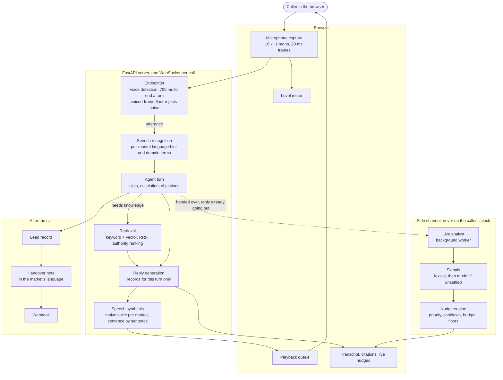
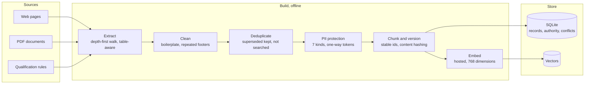
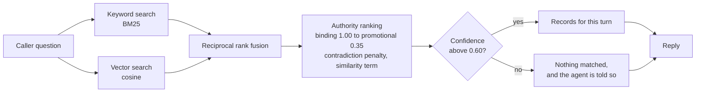

# Architecture

Two pipelines that meet at one place. The knowledge base is built ahead of
time and offline; the call runs in real time and reads from it. They share
nothing else, which is deliberate: a policy change is a rebuild, not a code
change, and the agent cannot quote a term that no longer exists.

---

## 1. The call

The dotted line is the only one that matters for understanding the design.
Analysis is handed over **before** the audio goes out, so the two overlap. The
reply never waits for it.

### One turn, in order

| Stage | Typical |
| --- | --- |
| Endpointing, caller stops to turn detected | ~700 ms |
| Speech recognition | ~400 ms |
| Retrieval | ~120 ms |
| Reply generation | ~1.5 s |
| First sentence synthesised | ~700 ms |
| **Caller hears the first word** | **~3.5 s** |

Measured from the moment the caller stops talking, which is the silence they
actually experience. Recorded call medians run 4.9 to 5.7 seconds on the free
tier, where throttling rather than work is the difference.

### Two things about the audio path

**Half duplex by default.** While the agent speaks, the microphone is ignored
for the length of the reply plus 400 ms. On laptop speakers the microphone
hears the agent, the recogniser turns that into words, and the agent answers
itself — which happened, and is why four separate guards exist. Callers on
headphones can tick a box and interrupt freely.

**Speaker attribution is free.** The server transcribed the caller and
generated the agent's text, so it knows which side every word came from. No
diarization is inferred, and the compliance detectors can be applied to the
agent alone.

---

## 2. The knowledge base

### Retrieval, per turn

**Grounding is structural, not instructed.** The model is given only the
records retrieved for the current turn, rebuilt every turn, and told plainly
when nothing matched. It is not asked to be honest about what it does not
know; it is not given the material to invent from.

Two things are stored but never searched: superseded duplicates, kept for
traceability, and escalation routing rules, which say where a call goes rather
than answering anything.

**Citations mean the answer used that record.** A record is only cited when
distinctive words from it appear in the reply. Citing everything retrieved put
five sources under a questionnaire line that answered nothing, which teaches a
reader that citations mean nothing.

---

## 3. Markets

One code path, three configurations. Nothing about a market lives in code.

| | Philippines, English | Philippines, Taglish | Indonesia |
| --- | --- | --- | --- |
| Pack | `health_shield_en` | `life_ph` | `multifinance_id` |
| ASR language hint | `en` | **none, deliberately** | `id` |
| Voice | `en-US-AriaNeural` | `fil-PH-BlessicaNeural` | `id-ID-GadisNeural` |
| Regional handling | — | — | Javanese, Sundanese |

Taglish gets no language hint because forcing Tagalog makes the recogniser
spell the English half phonetically, and half of what a Filipino caller says on
an insurance call is English. That decision is measured, not asserted:
`results/asr_evaluation.md`.

Each pack carries its own conversation flow, objection handling, escalation
triggers, closing lines, and the lines said when the system itself fails — so
a call never switches to English at the moment something has gone wrong.

---

## 4. Choices worth defending

**Gemini for replies, Groq as failover.** On the call path a throttle goes
straight to the second provider rather than retrying: retrying spent three
seconds and failed over anyway, so the caller heard three seconds of silence to
reach the same answer.

**Groq Whisper for recognition, Deepgram measured against it.** 97% against
73% overall, and the gap is entirely Taglish and regional speech. Latency
decides it independently: 346 ms against 3141 ms.

**Short domain hints.** A hint is also a list of words the recogniser hands
back when it cannot make out the audio, so it carries only terms a general
recogniser gets wrong. Cutting the ordinary words out left accuracy at 97%.

**Hosted embeddings, not local.** A local model scored −0.024 on
Tagalog against English, worse than random. Hosted scored +0.895.

**Deliberation off on the call path.** Thinking tokens are charged against the
output budget, and with a short limit what came back was fragments of reasoning
rather than an answer.

**One background worker for analysis, dropping rather than queueing.** A
backlog on a live call is worthless: advice about turn two delivered at turn
nine is not advice.
